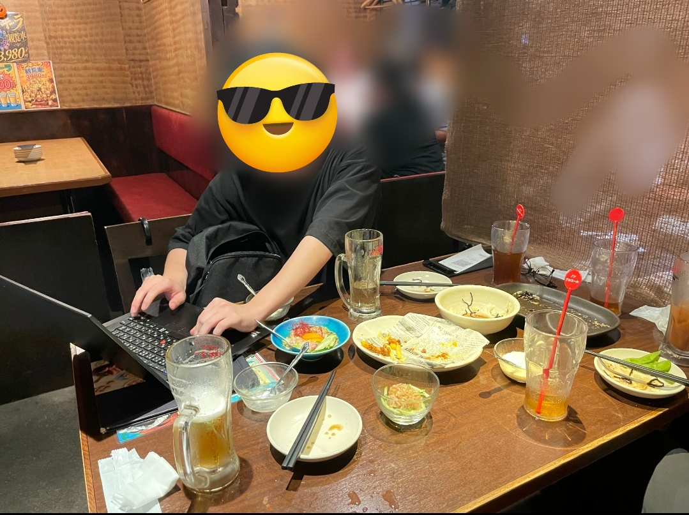
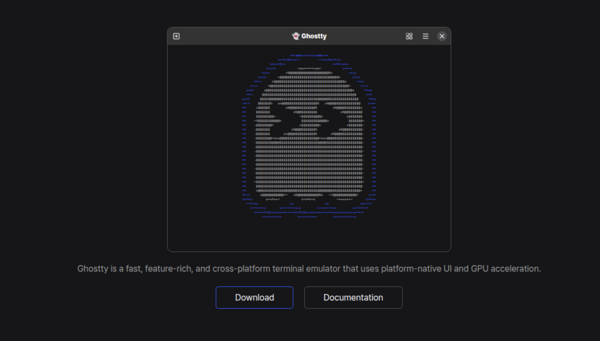
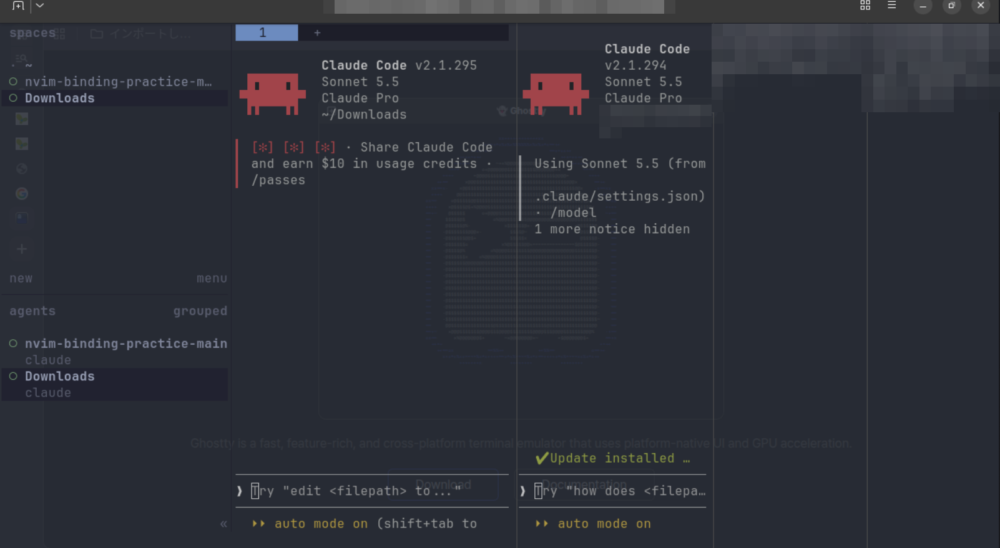
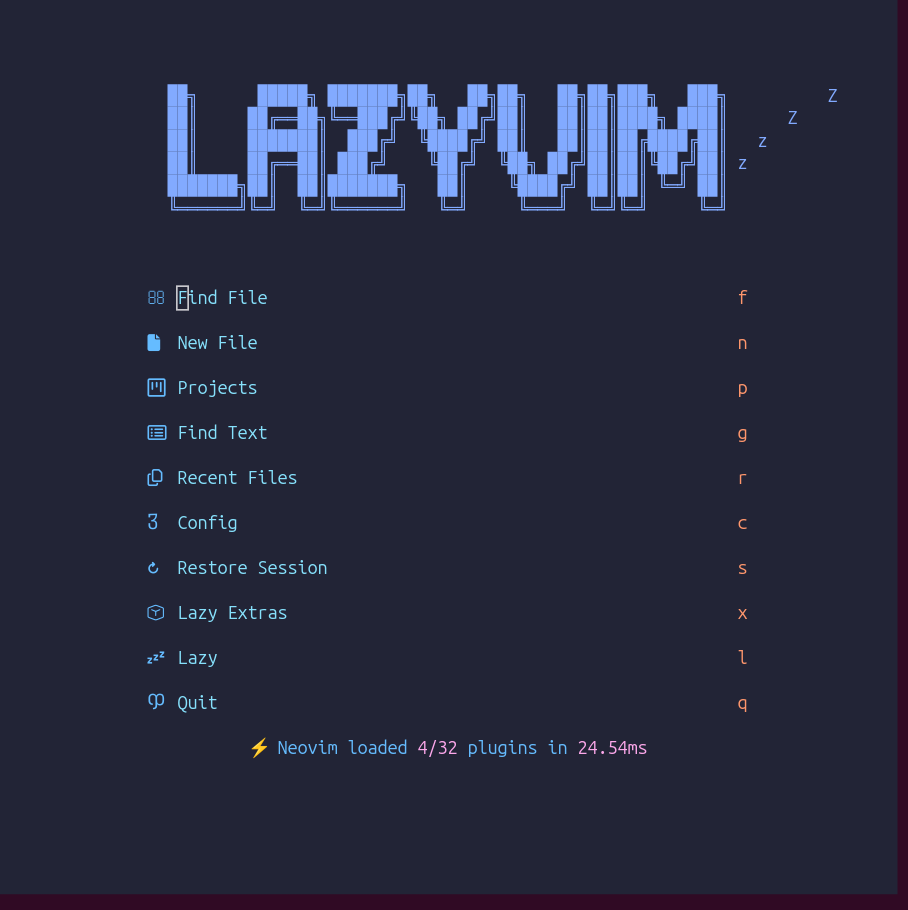

<!-- _class: lead title -->
<!-- _paginate: false -->

# 夏休みにやったこと いろいろ
### 〜インターン,linux入門,ターミナルすけすけ界隈〜

北大IT LT / 北海学園大学３年 / 松森瑛己

---

## 自己紹介

松森瑛己 / 北海学園大学英米文化学科３年

- 最近、シャニマスの曲を聞くのにハマっている
- お気に入りは day the sky、シャイノグラフィ

---

<!-- _class: "" -->
## 本日のアジェンダ（目次）

1. 土日14時間寝て終わった話
2. 東京のインターンに参加
3. 職業エンジニアの難しさと楽しさ（命名・慣習・費用対効果）
4. 穏やかな先輩が飲み会で突然Linuxを語り出した件
   〜Thinkpadを取り出して~
5. 先輩の話を聞いて、インターン中にUbuntuインストール
6. apt?snap?なんじゃそれ
7. VirtualBoxとメモリ使用量との格闘
8. ターミナルすけすけ界隈との遭遇
9. Ghosttyの描画が早すぎてキモい話
10. Herdrによる複数エージェント並列管理
11. Neovim (LazyVim) 入門
12. まとめ ＆ Linux元年の幕開け

---

<!-- _class: lead -->
## 安心してください、**つまみます！**

（※ 5〜10分で駆け抜けます）

---

<!-- _class: lead -->
## 東京に**インターン**に 行ってきた

<!--
写真案: 東京の写真

-->

---

<!-- _class: lead -->
## インターンで得たこと

### 職業エンジニアとして働く **難しさ**と**楽しさ**

---

## **難しさ**：作れたら終わりじゃない

- 他人が見てわかる**命名**か？
- 既存の**慣習**に従っているか？
- **費用対効果**は合っているか？

---

## **楽しさ**：難しいことが できたときの面白さ

- 難しいこともある
- でも、課題を解決したら楽しい。

---

## **学んだこと**

- 自分の**現在のレベル**がわかる
- すごい人がたくさんいる
- **面白い人**（と変人）に出会える

---

## チーム懇親会で、 落ち着いてる先輩に異変

> 「おい、お前らLinuxを使え。 **Linuxはいいぞ**」

---

<!-- _class: lead -->
## 実は前から、 Linuxの導入を**検討**していた

---

<!-- _class: lead -->
## 先輩の話を聞いて、 **インターン中**に **Ubuntu** を導入

---

<!-- _class: lead -->
## apt? snap?

---

## 使いたいアプリが動かない

- 最新版が降ってこない
- どんなアプリを探すのが楽しい
- エラーが出た際自分で解決する必要がある
- 最悪`VirtualBox`

<!--
写真案: Ubuntuのデスクトップ

-->

---

## でも、なぜか**楽しい**

- メモリ消費が少なくて動作が軽い！
- 無駄なアプリがないスッキリ感
- 自分のPCを完全に掌握している **Linux使ってるでドヤ!「アイデンティティ」** の獲得 ✨

---

## 先輩の画面が **すけすけ**だった

> 背景が透けてて、ペインが4分割…！？ かっこよすぎ…

---

## 爆速ターミナル **Ghostty**

- 描画が早すぎてキモい（褒め言葉）
- gnomeと違って綺麗に背景をすけさせられる！

[https://ghostty.org/](https://ghostty.org/)

---

## **Herdr** で並列管理

- AIエージェントを複数走らせるとき タブ移動不要
- 画面一覧で把握できて便利

---

<!-- _class: lead -->

## 夢： **思考の速度**でコーディング

### Neovim (LazyVim)

キーバインドがバチッと決まったときの快感は異常。

---

<!-- _class: lead -->
## 現実： コマンドを思い出せずカーソルが止まる

今のタイピング速度：**「速度おじいちゃん」** 👵

---

<!-- _class: lead -->
## インターンは、お金ももらえるし **東京で遊べる！**

---

<!-- _class: lead -->
## 💡 おわりに

「……というわけで駆け抜けてきましたが、」

---

<!-- _class: lead -->

### 最初のアジェンダ12個、
## 1個ずつバラせば何回かLTできましたね。

（1回の発表でネタを全放出しすぎた）

---

<!-- _class: lead -->
<!-- _paginate: false -->
## 皆さんもLinuxを入れて、 **Linux元年**を始めましょう！

### ご清聴ありがとうございました！ 🐧
